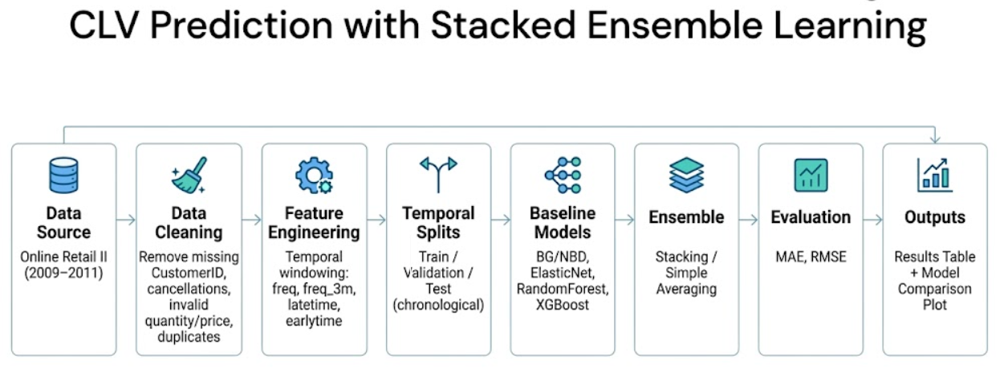

# Agentic Stacked Ensemble for Customer Lifetime Value Prediction

**Author:** Shubh Sehgal (ss8179@rit.edu)
**Course:** IDAI-780 Capstone Project — Rochester Institute of Technology
**Instructor:** Prof. Zhiqiang Tao

---

## Overview

This project predicts Customer Lifetime Value (CLV) as a count regression task — how many transactions a customer will make in the next 3 months using their past 6 months of purchase history. The core contribution is a **two-level stacked ensemble** orchestrated by a **LangGraph agent with Gemini 1.5 Flash**, which autonomously selects the best base models and final winner based on validation MAE — never touching the test set until the end.

The stacked ensemble with a context-aware meta-learner (Config B) achieves a **test MAE of 0.712** — a **35% improvement** over the best individual baseline and only **7.7% degradation** from validation to test, compared to 25–35% for all baselines.

---

## Project Workflow



---

## Dataset

**Online Retail II** — UCI Machine Learning Repository.

| Component | Value |
|---|---|
| Source | UCI Online Retail II |
| Retailer | UK-based, Dec 2009 – Dec 2011 |
| Raw rows | 1,067,371 transaction line-items |
| Clean rows | 779,425 (73% retained) |
| Unique customers | 5,878 |
| Unique invoices | 36,969 |
| Unique products | 4,631 |
| Countries | 41 |
| Train rows | 12,426 (4 cutoffs) |
| Val customers | 2,718 (cutoff: Jun 2011) |
| Test customers | 2,813 (cutoff: Sep 2011) |
| Target | Invoice count in next 3 months |

**Data files:** `data/Year 2009-2010.csv` and `data/Year 2010-2011.csv`

**Cleaning steps:**
1. Remove missing CustomerID (−243,007 rows)
2. Remove cancellations/returns (−18,744 rows)
3. Remove invalid Quantity/Price (−71 rows)
4. Remove duplicates (−26,124 rows)

---

## Feature Engineering

Seven behavioral features computed per customer from the 6-month observation window:

| Feature | Description |
|---|---|
| `freq` | Total purchases in observation window |
| `freq_3m` | Purchases in last 3 months (recent activity) |
| `latetime` | Days since last purchase (recency) |
| `earlytime` | Days since first purchase (tenure) |
| `monetary_total` | Total spend in window |
| `monetary_avg_invoice` | Average spend per visit |
| `unique_products` | Number of distinct products purchased |

---

## Methodology

### Temporal Windowing

For each cutoff date T:
- **Observation window:** `[T−6mo, T)` → compute features
- **Prediction horizon:** `[T, T+3mo)` → count unique invoices (target)

Four training cutoffs (Jun/Sep/Dec 2010, Mar 2011) yield **12,426 training rows**. All splits are strictly chronological — no future data leaks into training.

### Agentic Orchestration

The full pipeline runs inside a **LangGraph StateGraph** agent with **Gemini 1.5 Flash**:

1. Agent trains all 11 baseline models on the same feature set and temporal splits
2. **Gemini Decision 1:** Select top-3 baselines by validation MAE → promote to Level-1
3. Generate OOF predictions via `TimeSeriesSplit(n_splits=5)` — no leakage
4. Train meta-learner (ElasticNet) on OOF matrix
5. **Gemini Decision 2:** Select overall winner on validation MAE
6. Compute test metrics once, in the final report node only

### Stacked Ensemble Configurations

**Config A** — meta-learner uses base predictions only:
```
ŷ = g(h₁(x), h₂(x), h₃(x))          [N × 3 matrix]
```

**Config B** — meta-learner uses base predictions + original features:
```
ŷ = g(h₁(x), h₂(x), h₃(x) ‖ x)     [N × 10 matrix]
```

Meta-learner: ElasticNet (α=0.1, ℓ₁-ratio=0.5)

---

## Project Structure

```
clv-stacking/
├── data/                          # Dataset files (CSV)
├── figures/                       # Plots and results images
├── notebooks/
│   ├── CKPT2.ipynb                # Baselines + EDA
│   ├── CKPT5_LangGraph_Orchestrated.ipynb  # Full agentic pipeline
│   ├── CKPT6_Alt_Techniques.ipynb # Alternative techniques
│   ├── CKPT7_RNN_Sequence.ipynb   # RNN experiments
│   └── inference.ipynb            # Batch inference demo
├── src/
│   ├── data.py                    # Data loading and cleaning
│   ├── features.py                # Temporal windowing + feature engineering
│   ├── baselines.py               # All 11 baseline implementations
│   ├── stacking.py                # StackedEnsemble class (Config A/B)
│   ├── react_agent.py             # LangGraph orchestrator
│   ├── eval.py                    # Metrics and evaluation
│   ├── analysis.py                # Feature importance + error segmentation
│   ├── two_stage.py               # Two-stage hurdle model
│   └── demo_utils.py              # Demo utilities
├── checkpoints/                   # Saved model artifacts (joblib)
├── results/                       # Metrics JSON and CSV outputs
├── requirements.txt
└── README.md
```

---

## Setup

```bash
# 1. Create environment
python -m venv venv
source venv/bin/activate  # Windows: venv\Scripts\activate

# 2. Install dependencies
pip install -r requirements.txt

# 3. Add dataset files to data/
# Download from: https://archive.ics.uci.edu/dataset/502/online+retail+ii

# 4. Set up Gemini API key (for agentic pipeline)
echo "GEMINI_API_KEY=your_key_here" > .env
```

---

## Running the Pipeline

### Full Agentic Run (recommended)
```bash
jupyter notebook notebooks/CKPT5_LangGraph_Orchestrated.ipynb
```
Runs the complete pipeline in one `agent.run()` call — trains 11 baselines, stacking configs, Gemini decisions, and final report.

### Baselines Only
```bash
jupyter notebook notebooks/CKPT2.ipynb
```

### Batch Inference Demo
```bash
jupyter notebook notebooks/inference.ipynb
```
Loads saved checkpoints and runs predictions on 20 held-out customers.

---

## Results

All results produced by one `agent.run()` call. Underlined models were selected by Gemini as Level-1 base models.

| Model | Val MAE | Val RMSE | Test MAE | Test RMSE |
|---|---|---|---|---|
| BG/NBD (probabilistic) | 1.015 | 1.973 | 1.390 | 3.028 |
| KNN | 0.961 | 1.847 | 1.261 | 2.619 |
| SVR | 0.942 | 1.802 | 1.209 | 2.641 |
| Poisson Regression | 0.934 | 1.789 | 1.222 | 1.920 |
| Two-Stage (Hurdle) | 0.912 | 1.741 | 1.189 | 2.103 |
| MLP | 0.901 | 1.698 | 1.171 | 1.964 |
| HistGradientBoosting | 0.893 | 1.671 | 1.158 | 1.923 |
| Simple Average | 0.887 | 1.654 | 1.147 | 1.901 |
| __XGBoost__ | 0.877 | 1.530 | 1.110 | 1.834 |
| __RandomForest__ | 0.871 | 1.511 | 1.104 | 1.948 |
| __ElasticNet__ | 0.864 | 1.510 | 1.122 | 2.161 |
| Config A (preds. only) | 0.874 | 1.528 | 1.150 | 2.223 |
| **Config B (preds.+features)** | **0.661** | **1.192** | **0.712** | **1.367** |

### Key Findings

**RQ1:** Config B achieves test MAE **0.712** — a **35% improvement** over the best single baseline (RandomForest, 1.104) and **49% over BG/NBD**.

**RQ2:** Config B beats Config A by **0.438 MAE (38%)** — giving the meta-learner original customer features enables context-aware weighting rather than blind combination.

**RQ3:** Config B degrades only **7.7%** from val (0.661) to test (0.712). Individual baselines degrade **25–35%** — the stacked ensemble is substantially more robust to temporal distribution shift.

---

## Evaluation Protocol

- **Splits:** Strictly chronological — train on past, validate and test on genuinely future periods
- **OOF:** `TimeSeriesSplit(n_splits=5)` — each customer's prediction made by a model that never saw them
- **Model selection:** Validation MAE only — test set touched exactly once at the end
- **Metrics:** MAE (primary), RMSE (secondary)

---

## References

1. Chamberlain et al. (2017). Customer lifetime value prediction using embeddings. *KDD 2017.*
2. Huang, C.Y. (2012). To model, or not to model: Forecasting for customer prioritization. *International Journal of Forecasting.*
3. Vanderveld et al. (2016). An engagement-based CLV system for e-commerce. *KDD 2016.*
4. UCI Online Retail II Dataset. https://archive.ics.uci.edu/dataset/502/online+retail+ii
