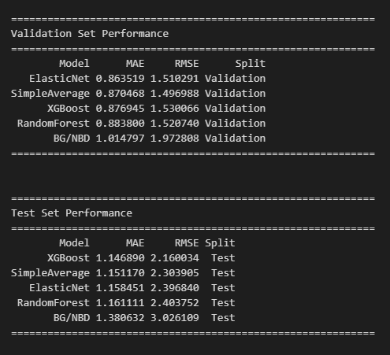

# CLV Prediction with Stacked Ensemble Learning

**Author:** Shubh Sehgal (ss8179@rit.edu)  
**Course:** IDAI-780 Capstone Project  
**Checkpoint:** CKPT3 - Baselines + Core Implementation

**Overview**
This project predicts Customer Lifetime Value (CLV) using stacked ensemble learning on the Online Retail II dataset. The pipeline includes data cleaning, temporal feature engineering, baseline models, and ensemble comparison with MAE/RMSE evaluation.

**Project Workflow**


**Dataset**
Online Retail II from the UCI Machine Learning Repository.
- Time period: December 2009 to December 2011
- Size: ~1M transactions, ~5,850 customers
- Files used: `data/Year 2009-2010.csv` and `data/Year 2010-2011.csv` (CSV) or the original Excel files

**Project Structure**
```
clv-stacking/
|-- data/                  # Dataset files (CSV or Excel)
|-- figures/               # Plots and results images
|-- notebooks/             # CKPT2 notebook
|-- src/                   # Source code modules
|-- requirements.txt       # Python dependencies
|-- README.md              # Project documentation
```

**Setup and Reproduction (CKPT2 Notebook)**
1. Environment setup: Python 3.9+ recommended. Install dependencies:
   ```bash
   pip install -r requirements.txt
   ```
2. Data preparation: Download Online Retail II from UCI and place files in `data/`. If your file paths differ, update the data path cell in `notebooks/CKPT2.ipynb`.
3. Run the notebook:
   ```bash
   jupyter notebook notebooks/CKPT2.ipynb
   ```
   Run all cells to reproduce preprocessing, baseline training, and evaluation.

**Key Results (Validation/Test MAE and RMSE)**


| Model            | Val MAE | Val RMSE | Test MAE | Test RMSE |
|------------------|--------:|---------:|---------:|----------:|
| ElasticNet       | 0.8635  | 1.5103   | 1.1585   | 2.3968    |
| RandomForest     | 0.8838  | 1.5207   | 1.1611   | 2.4038    |
| XGBoost          | 0.8769  | 1.5301   | 1.1469   | 2.1600    |
| BG/NBD           | 1.0148  | 1.9728   | 1.3806   | 3.0261    |
| Simple Averaging | 0.8705  | 1.4970   | 1.1512   | 2.3039    |

**Baseline Models**
- BG/NBD (lifetimes)
- ElasticNet
- RandomForest
- XGBoost
- Simple Averaging

**Evaluation Protocol**
- Temporal splits: Train (2010) -> Validation (early 2011) -> Test (late 2011)
- Metrics: MAE, RMSE
- Target: transactions in next 3 months
- Features: freq, freq_3m, latetime, earlytime

**Research-Grade Temporal Protocol (New)**
Two additional notebooks implement a stricter temporal stacking protocol that is suitable for reporting:
- `notebooks/CKPT2_Temporal.ipynb`: builds a multi-cutoff training set and saves outputs under `data/temporal`, `models/temporal`, `results/temporal`
- `notebooks/CKPT3_Temporal_Stacked_Ensemble.ipynb`: runs stacking using true time order and saves checkpoints under `checkpoints/temporal`

**What Was Fixed (Before vs After)**
- Before: Training set used a single cutoff window, so within-train time ordering was not meaningful for forward-chaining.
- After: Training set is built from multiple cutoffs and sorted by `cutoff_date`, enabling true temporal ordering.
- Before: Stacking comments implied reuse of baseline weights; models were actually re-trained, but this was not explicit.
- After: CKPT3 builds untrained templates from saved baseline hyperparameters, then retrains per fold (correct stacking behavior).
- Before: OOF generation could include fold issues/leakage or incomplete coverage.
- After: OOF is generated with time-ordered splits over multi-cutoff data, and meta-learner trains only on rows with full OOF predictions.
- Before: Checkpoints only saved logs.
- After: Temporal checkpoints save `meta_learner.pkl` and `base_models.pkl` in `checkpoints/temporal`.

**References and Acknowledgments**
- UCI Machine Learning Repository: Online Retail II dataset
- scikit-learn, xgboost, lifetimes
